# RateProfessor Project - CptS322 - Fall2019

Before we jump into the main team projects, we will practice  web
development by building a RateProfessor app.
It's split into three parts,  (1) HTML/CSS, (2) Javascript, and (3) Backend.

RateProfessot is an app which allows college and university students to rate and review the professors of Washington State University. It's inspired by ratemyprofessor.com. Students taking a particular professor's course may post a review and see the reviews provided for the professors that are already listed on the site. If a professor is not listed on the site, students may add the professor to the site.  

You'll be building out these features:
- Create a new professor profile
- Rate and review a professor
- View all reviews posted for a professor.

This is how it is going to look at the end of Part 1 of the project:

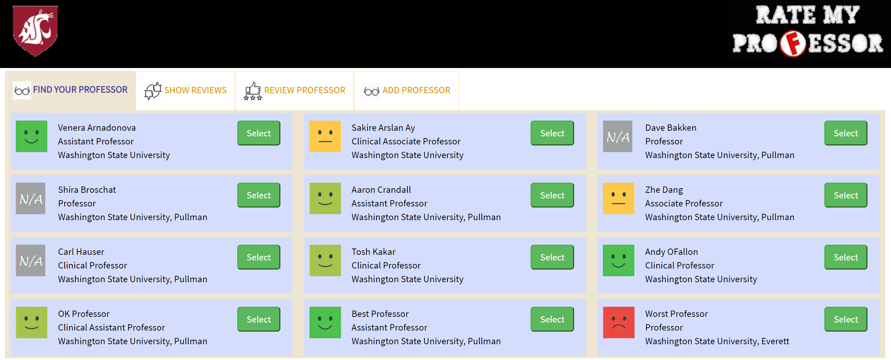
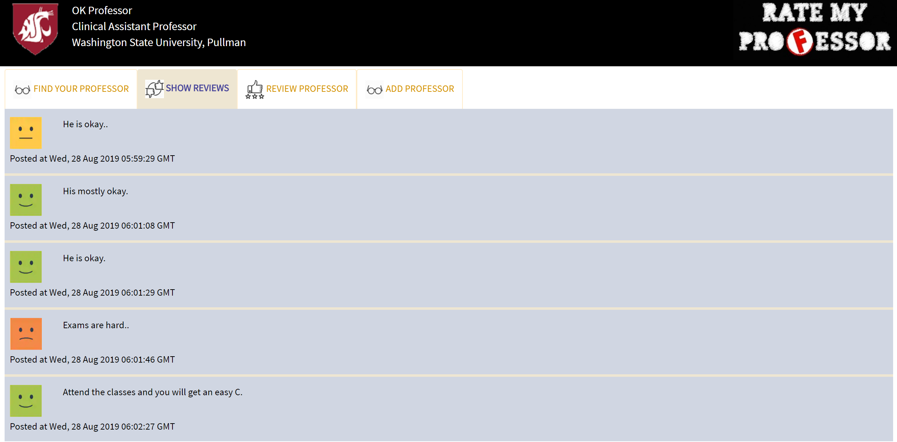
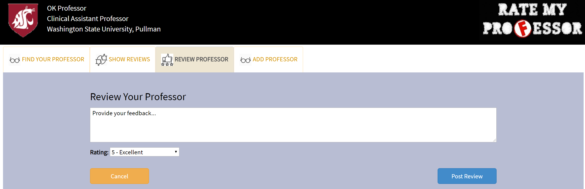
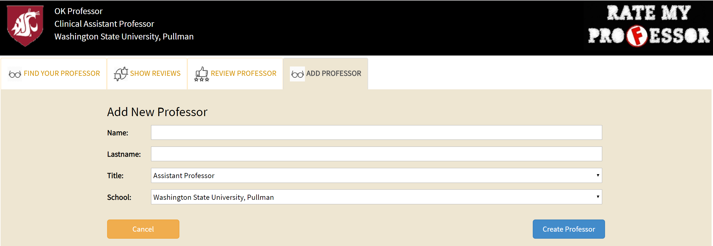

## Part 1: HTML/CSS

In part 1, we will build the UI (user interface) for the app. It won't be hooked into a database yet to store the professor information and the reviews - that will come in part 2. This part is just about learning how to build UI using semantic HTML, customize the layout, style it, and make it responsive - responsive, meaning the UI scales nicely for desktop browsers and mobile phone browsers.

---
### Task 1: Get Started with the Provided Files
---
To help you start we have provided some boilerplate files that you will have to
modify to implement the project.


1. Clone the repository [rateprofessor_project_322_skeleton repository](https://gitlab.eecs.wsu.edu/322-fall19-arslanay-warmup/rateprofessor_322_skeleton) on the working machine
    ```
    git clone https://gitlab.eecs.wsu.edu/322-fall19-arslanay-warmup/rateprofessor_322_skeleton.git
    ```
    You'll be prompted to enter your username and password (those you used to login gitlab.eecs.wsu.edu). If succeeded, you'll see a new directory show up.
  
2. Next, you need to go to the repo directory and checkout all of the branches that have already been created for you.
    ```
    cd rateprofessor_322_skeleton/
    git checkout part1
    git checkout master
    ```

3. You now have a local copy of the `rateprofessor_322_skeleton` repository.

    ```
    git remote -v
    ```
    This will display all remote repositories. Currently, it should show the following:
    ```
    git remote -v
    origin  https://gitlab.eecs.wsu.edu/322-fall19-arslanay-warmup/rateprofessor_322_skeleton.git (fetch)
    origin  https://gitlab.eecs.wsu.edu/322-fall19-arslanay-warmup/rateprofessor_322_skeleton.git (push)

    ```
    Now, you need to copy the skeleton code to the **private** repository that we created on EECS GitLab server and commit everything to this repository. The name of this repository is `<yourlastname>-warmup`. (Make sure that this repository shows up in your GitLab account.) 
    Now remove the commit origin with the following command.

    ```
    git remote remove origin
    ```

4. Next you need to add your repository as the new origin.

    ```
    git remote add origin https://gitlab.eecs.wsu.edu/322-fall19-arslanay-warmup/<yourlastname>-warmup
    ```
    IMPORTANT NOTE: Replace "`<yourlastname>`" with your own lastname. **REMOVE enclosing angle brackets , i.e., <>**.  

    You can `git remote -v` to test to make sure origin is changed.


5. Push the code to your new branch.
    ```
    git push --set-upstream origin master
    git push --all
    ```
    Now if you go to your EECS GitLab repo, you will see all of the relevant files. Make sure that both `master` and `part1` branches are pushed to the GitLab sever. 

    To keep your local repo name consistent, rename your local repo directory. 
    ```
    cd ..
    mv rateprofessor_322_skeleton/ <yourlastname>-warmup
    cd <yourlastname>-warmup
    ```

6. Switch to branch named `part1`
    ```
    git checkout part1
    ```
    You will now be editing locally, and **remember to commit frequently**.

    You will find the following provided files:
    
        * static/images
            * `ratemyProf.jpg` logo that shows on the page header and the browser tab
            * `wsu_shield.png` icon that shows on the page header
            * `ratings.png` sprite for levels of rating
            * `review-list.png`,`review.png`,`prof.png` icons for tabs
            
        * static/styles
            * `main.css` where all the styling goes
        * static/html    
            * `index.html` home page
        * static/scripts (not needed for Part 1; will need for Part 2)
        * backend.py (not needed for Part 1; will need for Part 3)
            
    You will have to make changes to the .css and the .html files.

7. Open the `index.html` file with a browser to see the initial
   version of the provided files.
    * for Chrome, File/Open File, choose /static/index.html


    At this point if you open `index.html` it should look like the following. Note that the skeleton code provides the HTML and CSS code to create all 4 navigation tabs for the web page. We used "Bootstrap Tabs" for this. Please do not change the HTML code and styling for the tabs. 
   
    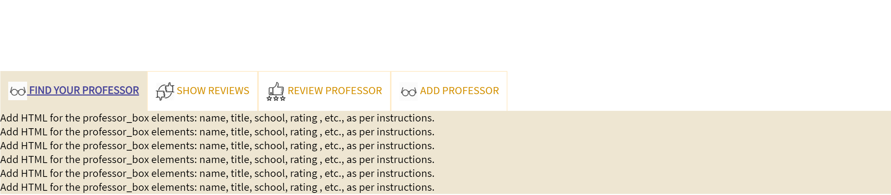
    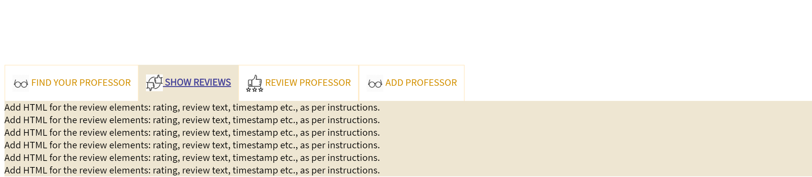

---
### Task 2: The Header
---
First, we will build the page header. The header will display the loos and information about the currently selected professor. 

Add elements to the page by following the instructions below. You will edit `static\index.html` and `\static\styles\main.css`.

1. Header with WSU shield, logo, and the `selected professor`. 
1. The whole header should be as wide as the browser window. (Hint: `display: block`,  percentage `width`, `height: 130px`)   
1. Add a `<div>` to the header with class `header_row`. Assign the "`display`" property of  "`header_row`"  as "`flex`" and "`flex-direction`"as "`row`". 
1. The `<div>` with class `header_row` should include 3 inner `<div>` elements (for the WSU shield, logo, and the "selected professor", respectively):
    1. `<div>` with class `wsu_logo_col`. Add the WSU shield image  with class `wsu_logo` in this element. You can find the WSU shield in `images/wsu_shield.png`. In CSS, set the `width` of this element as large as the image (i.e., 130px)
    1. `<div>` with class `selected_prof`. The selected professor's info will be displayed with this element. It should include:
        1. **Professor's name.** Use a `<div>` element with HTML class "`selected_name`".
        1. **Professor's title.** Use a `<div>` element with HTML class "`selected_title`".
        1. **Professor's school.** Use a `<div>` element with HTML class "`selected_school`".          
    1. `<div>` with class `logo_col`. Add the logo image  with class `logo` in this element. You can find the logo image in `images/ratemyProf.png`. Feel free to design your own. In CSS, set the `width` of this element as large as the image (i.e., 310px)  
    1. The `selected_prof` column should use the rest of the space in the header. Set `width: calc(...)` for `selected_prof`. The text should be left alligned. You may add a top margin to adjust the vertical alignment.

1. The header (including the WSU Shield, selected professor info, and the logo ) should be always stick to the top and remain visible on the screen as you scroll. (Hint:   `position: fixed`; also set   `background-color` (e.g., black) and `color` (e.g. white) on the `<header>` to ensure that the posts  scroll underneath. Also make sure that the "`top`"" position of the "`header`" is set to 0. You may also add some padding to the `header`. )

1. Add some content for the "`selected_name`", "`selected_title`", and "`selected_school`" elements.

Note that the main page  content including the tabs are wrapped in a `<div>` with class `mytab`. You may adjust `margin-top` for the `.mytab` `<div>`  to ensure it is not hidden by the header.)

At this point if you open `index.html` it should look like the following. 
   
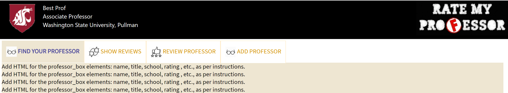


---
### Task 3: The "FIND YOUR PROFESSOR" tab
---
The first page you'll build is the home page ("FIND YOUR PROFESSOR" tab). This tab will show all the professors that have been added to the site.


#### Task 3.1: Basic HTML Elements

Add elements to the page by following the instructions below. You will edit `static\index.html` and `\static\styles\main.css`.

Add elements for all of the following. Don't worry about positioning or styling them yet. Try to use semantic elements that says something about the content it holds, rather than using the generic `<div>` for everything. E.g. use a `<header>` for page and section headers, or a `<nav>` if we had a navigation bar. Learn more about [HTML semantic elements](http://www.w3schools.com/html/html5_semantic_elements.asp).

1. Each `<div>` element with class `tab-pane` corresponds to the content of a particular tab. The skeleton code includes 4 tabs with ids `list`, `showreview`, `addreview`, and `addprof`. You will add elemets inside these `tab-pane` elements. 

1. The tab content with id `list` should display the list of the professors. The `<article>` element with class  `professor_box` displays a professors information.  Each `professor_box` should include:
    * **Overall Rating.** We'll be using a CSS background-image in Task 3.3 for this one, so for now, just create a `<div>` with the HTML class `rating_none`
     and write "`rating`" in it. In Task 3.3, we'll customize the professors to have a specific ratings.   

    * **Name.** Use a `<div>` element with HTML class "`name`". Enter a professor name as content. 
    
    * **Title.** Use a `<div>` element with HTML class "`affiliate`". Enter a professor's title (e.g., 'Associate Professor') as content.   
     
    * **School.** Use a `<div>` element with HTML class "`school`". Enter a professor's School (e.g., 'Washington State University, Pullman') as content.   

    * **Select button** for selecting the professor. Use a `<button>` element with the HTML class "`select_btn`" and the text "Select".   

1. Create 5 more professor posts, with different names, titles, and schools. 
    * They should have the same HTML structure as the first professor. We'll use all 6 professor posts while customizing layout.
    * Change the "`rating_none`" HTML class for the new posts to  "`rating_1`", "`rating_2`", "`rating_3`", "`rating_4`", and "`rating_5`",  respectively. This will allow you to test the display of the six different rating levels.
    At this point if you open `index.html` it should look like this:

    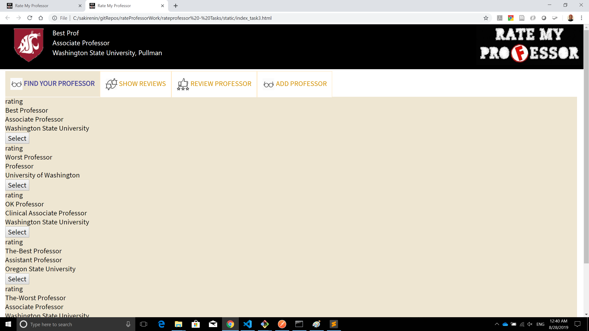


#### Task 3.2: Getting the Layout Right  

Now let's customize the layout and positioning of the elements. You'll be writing CSS in `/styles/main.css`. You will also have to make changes to `index.html`.

An important web design philosophy is the separation of content (HTML) from the presentation of content (CSS). So, even though you are able to write inline CSS in HTML tags, please don't do that!

1. Organize the professor content into three columns, so the rating is on  the left, the professor info (name, title, school) is in the center, and the select button is on the right.
  The width of the rating  column and select button column should be constant (e.g., 80px and 100px respectively), while the professor info column should scale wider if you widen your browser window.
   (Hint: **(i)** wrap the rating into a separate `<div>` with HTML class "`overall_rating`"; **(ii)** wrap all "`name`", "`affiliate`", and "`school`" into a separate `<div>` with HTML class "`prof_info`"; and **(iii)**  wrap the select button into a `<div>` with HTML class "`prof_button`". **(iv)** Set a fixed `width` for the rating and select button columns. Set `width: calc(...)` for the professor info. **(v)** Assign the "`display`" property of "`professor_box`" as "`flex`" and "`flex-direction`"as "`row`" so that the rating, professor info, and select button columns are organized as a row. )

\* We provide hints to help guide those with less CSS experience. If you know a different/better way to implement the same styling, feel free to use your way.

At this point if you open `index.html` it should look like this. If you scrolled
it down a bit the header should stay fixed:

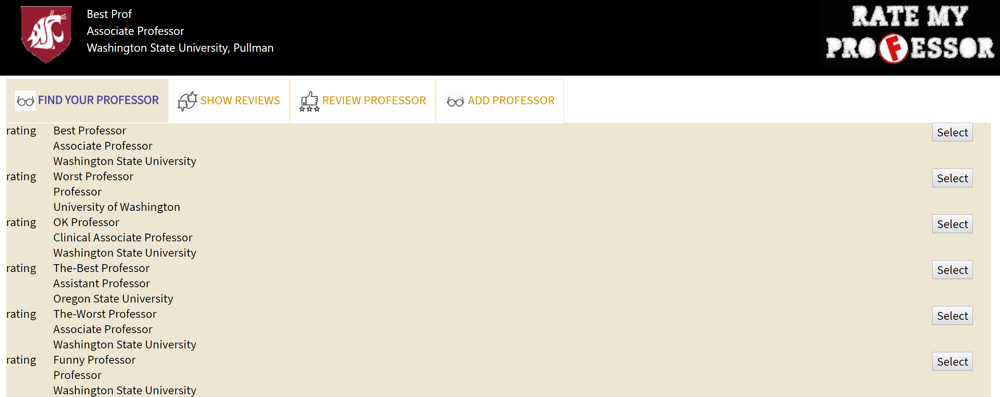


#### Task 3.3: Stylin' It Pretty

It's coming along! Now let's style it nicer and make it look like an actual app. We only have the following styling guidelines as far as what we're
grading you on. You can any additional styling to make it look however you think looks awesome.
For this task you only need to edit `/styles/main.css`.

1. Pick a nicer `font-family` than the default Times New Roman for the body. 
   Check out
   [browser-supported fonts](http://www.w3schools.com/cssref/css_websafe_fonts.asp)
   or
   choose from hundreds of free [Google Fonts](https://www.google.com/fonts). Use the same font for both `<header>` and "`mytab`"
1. The `font-size` for the `<header>` should be larger than the rest of the page (i.e. the selected professor's info should appear larger) .
   (Hint: use percentages)
1. In the given skeleton code, the `nav-tab` and `tab-pane`  has `background-color` of `#eee6d2`. You may update it if you like. 
1. Add nice `background-color` to the professor boxes so that they stands out from the background. 
1. Add `padding` to your containers. You can decide how much and on which elements.
1. Add more `margin` to each professor box so there is more spacing in between boxes.
1. To style the `Select` button, use Bootstrap's `btn-lg` and `btn-success` styling selectors (associate them with the buttons in HTML).  Or you may create your own styling for the button. 
  
1. Change the `rating_none` and other rating styles (`rating_1` through `rating_5`) to use `images/ratings.png` as background. (Hint: use  `background-image: url('../images/heart.png');`; adjust `height` and `width`; you can use `color: transparent` to make sure that the "`rating`" text you wrote in the HTML does not show up.)
    
    
    
You can create your own six-icon sprite, instead of `static/images/ratings.png`.  
    * You'll notice there are 6 images in one png. This is called a sprite. Developers often combine a bunch of icons onto one file to speed up page load time since every image requires a network request. 
    * Set "`width`" and "`height`" to "`60px`" (the size of one icon in the sprite). Set "`background-repeat`" to turn off repeating the image.
    * Add CSS definitions for each of the 6 rating levels (e.g.,"`.rating_1`") to position the sprite so it shows the right icon. Use `background-position: ...px ...px`.

At this point if you open `index.html` it should look like this:

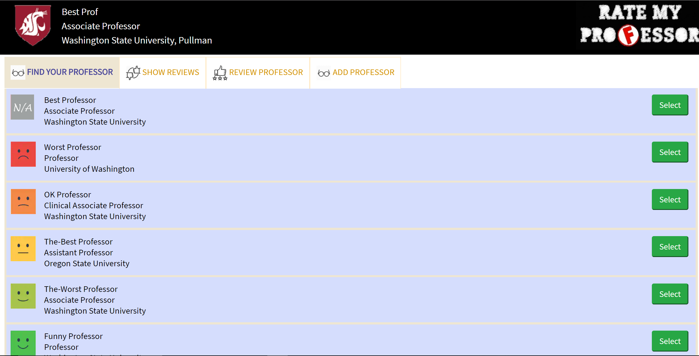

---
#### Task 3.4: Responsive Layout for Desktop and Mobile
---
There are CSS frameworks like [Bootstrap](http://getbootstrap.com/css/#grid) and [Foundation](http://foundation.zurb.com/grid.html)
which have grid layouts for developers to use just by adding pre-defined CSS column classes.
But in this project, we'll learn how to do responsive layouts manually and see how it works under the hood.

At the bottom of `styles/main.css`, you'll see a `@media screen` definition. `(min-width: 800px)` means the styles within this definition applies for browser screens 800px or wider.

1. Change the layout to show 1 box per row for screens narrower than  800px, in 2 boxes per row for screens between 800px and 1200px,
   and in 3 boxes per row for screens larger than 1200px.
   To enable this, we will make the `<section>` container that includes all professor boxes (`.professorlist`) a flex box and dynaminally adjust the width of each box for different screeen sizes. 
   (Hint: Make the width of the professor box 32% when the screen size is larger than 1200px; make it 48% when the screen size is between 800px and 1200px, and 98% when the screen size is less than 800px. Note that margins are not part of the width and the remaning 2%-4% is used for margins between the boxes.  )
   You can test the responsive styling by dragging your desktop browser window larger or smaller than 800px and 1200px.

1. The `.professorlist` should have `display:flex`, `flex-wrap:wrap`, and `justify-content : space-around`.


At this point if you open `index.html` it should look like this:

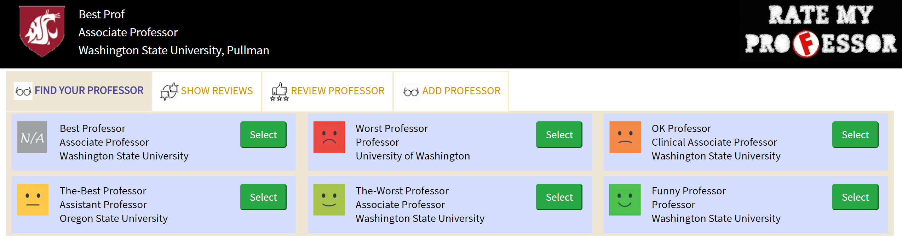

---
### Task 4: The "SHOW REVIEWS" tab
---
The next page you'll build is "SHOW REVIEWS" tab. This tab will be shown when a professor is selected and will display the reviews for the selected professor. 


#### Task 4.1: Basic HTML Elements

Add elements to the "SHOW REVIEWS" tab by following the instructions below. You will edit `static\index.html` and `\static\styles\main.css`. Most of the sub-tasks will be similar to those in Task-3. 

1. The `<div>` element with class `tab-pane`  and id `showreview`  should display the reviews of a professor. The `<article>` element with class  `review` displays the details of a review.  Each "review" should show:
    * **Review rating.** We'll be using a CSS background-image similar to Task 4.3, for now, just create a `<div>` with the HTML class `rating_none` and write "`rating`" in it. In Task 4.3, we'll customize the reviews to have a specific ratings.   
  
    * **Review text.** Use a `<div>` element with HTML class "`review_text`". Enter an actual review text that is a few lines long.    
     
    * **Timestamp** when this review was posted. Use a `<div>` element with HTML class "`timestamp`". Enter a sample content of the form "Posted at 1:03pm May 22, 2019".


1. Create 5 more review posts, with different rating value, review text, and timestamp.. 
    * They should have the same HTML structure as the first review. 
    * Change the "`rating_none`" HTML class for the new posts to  "`rating_1`", "`rating_2`", "`rating_3`", "`rating_4`", and "`rating_5`",  respectively. This will allow you to test the display of the six different rating levels.
    At this point if you open `index.html` and click at the "SHOW REVIEWS" tab it should look like this:

    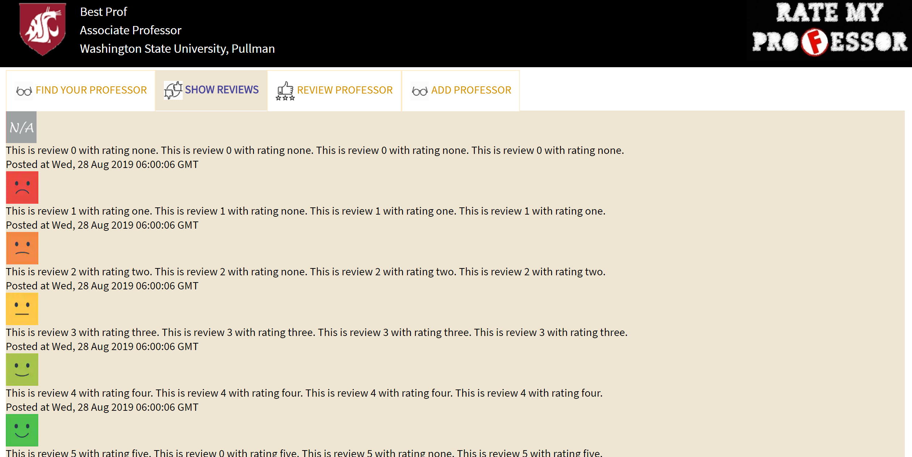

#### Task 4.2: Getting the Layout Right  

Now we will customize the layout and positioning of the elements. 

1. Organize the review content into two columns, so the rating is on the left, the review text is on the right.
  The width of the rating column should be constant (e.g., 100px ), while the review text column should scale wider if you widen your browser window.

   (Hint: **(i)** wrap the rating into a separate `<div>` with HTML class "`review_rating`"; **(ii)** wrap "`review_rating`" and "`review_text`"into a separate `<div>` with HTML class "`review_row`"; and **(iii)**  Set a fixed `width` for the "`review_rating`" and set `width: calc(...)` for the "`review_text`". **(iv)** Assign the "`display`" property of "`review_row`" as "`flex`" and "`flex-direction`"as "`row`" so that the rating and review text are organized as a row. )

1. The timestamp should be underneath the rating and review text. You may add some padding to the top to seperate the timestamp from the rating and review text. 

At this point if you open `index.html` and click at the "SHOW REVIEWS" tab it should look like this:

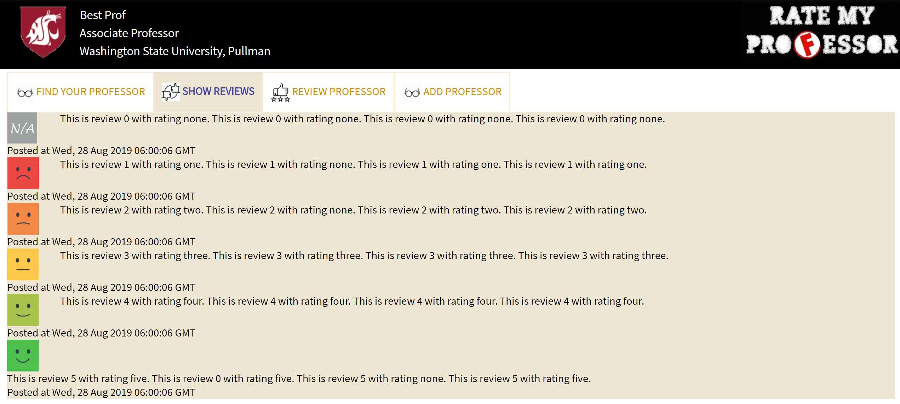

#### Task 4.3: Stylin' It Pretty

Now let's style and make the "SHOW REVIWS" tab nicer. For this task you only need to edit `/styles/main.css`.

1. Add nice `background-color` to the review boxes so that they stands out from the background. 
1. Add `padding` to your containers. You can decide how much and on which elements.
1. Add  `margin` to each review box so there is more spacing in between boxes.
1. In Task 3.3, we already styled the class selectors for `rating_none` and  `rating_1` through `rating_5`. The same style will apply to the ratings of the reviews. 

At this point if you open `index.html` and click at the "SHOW REVIEWS" tab it should look like this:

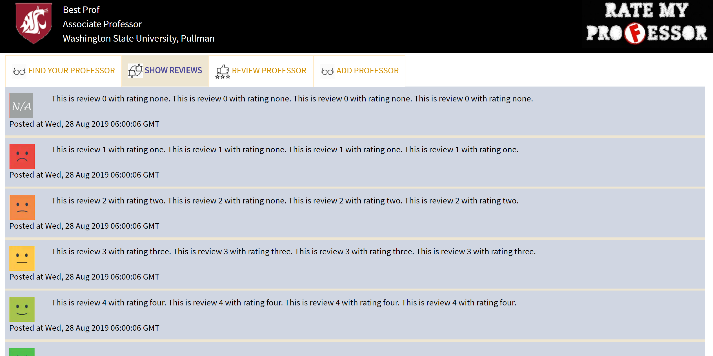

---
### Task 5: The "REVIEW PROFESSORS" tab
---
The next page you'll build is "REVIEW PROFESSOR" tab. This tab will include a form for adding a new professor. 

#### Task 5.1: HTML Form Elements
Add elements to the "REVIEW PROFESSORS" tab by following the instructions below. You will edit `static\index.html` and `\static\styles\main.css`. **Note**: The "REVIEW PROFESSOR" tab is very similar to "ADD PROFESSOR" tab. The HTML code fore this tab is already provided in the given skeleton code. 

1. Inside the `form`, add a `<textarea>` element with class `review_input` and `name` attribute `review`. Use "Provide your feedback..." as placeholder text. 
1. Add a `select` dropdown with 5 options "`Excellent`", "`Good`", "`Average`", "`Poor`", and "`Terrible`" for the review rating. 
   The options should have "`value`" attribute equal to 5, 4, 3, 2, and 1 respectively.
  The 5 options will correspond to the rating level sprite icons. (You can rename the options if you'd like.) 
  Use the HTML class "`review_rating_input`" and `name` attribute "`rating`" for the `<select>`. 
1. Add a `label` for the rating  dropdown and title it "`Rating:`". Add it before the `select`.
1. Wrap the `label` and `select` elements inside a new div with class `rating_input_group`. 
1. Add a submit button using `<input type="submit"/>` with HTML class `submit_review_input`.
1. Change the submit button's text to `Post Review` (i.e., value="`Post Review`").
    Click on the button. It should take you to the home page ("FIND YOUR PROFESSOR" tab). Browsers by default handle clicking on `<input type="submit">` to redirect users to  wherever the `<form>`'s `action` attribute specified.
   
1. Last, add a "`Cancel`" button onto the form in case the user doesn't want to add a review. The cancel button should have class `cancel_review` and value `Cancel`.

At this point if you open `index.html` and click at the "REVIEW PROFESSOR" tab, it should look like this:

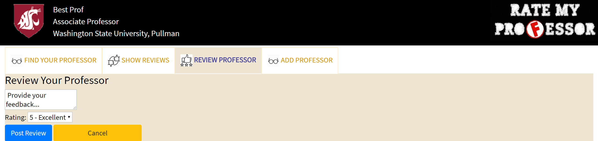


#### Task 5.2: Getting the Form Layout Right

All the form elements stack up squished horizontally. Let's make it look nicer.

1. We want the form to be centered in the middle with some padding on the left and right (Hint: make the
   `form` (with id `addReviewForm` have `display: block`, `margin: auto`, and 15% `padding` on left and right. In addition add some bottom padding (85px) to make up space for the buttons (In Task 5.2.4 below, we will make the buttons float which will take them out of the flow of the form. We need to add a padding large enough to include the buttons and the margins around them.)
1. Add nice `background-color` to the form  `addReviewForm`.
1. Make the width of the `review_input` textarea full width of the form. (Hint: `display: block`, `width`: 100%;)
    Add some margin above and below the textarea. Increase the `height` of the  textarea. 
1. Adjust the width of the `review_rating_input` (for example 200px). 
1. Position the Cancel and Post Review button, so the Cancel is on the left, and the
   Post is on the right. (Hint: `display: block` along with `float: left` | `float: right`)
1. Add some `padding` and `margin` to space out elements, wherever you think needs more spacing.You may also adjust the height of the form input elements (`rating_input_group`, `review_rating_input`, and `review_input`)
1. To style the "Post Review" button, use Bootstrap's `btn`, `btn-lg` and `btn-primary` styling selectors  in HTM2.  To style the "Cancel" button, use Bootstrap's `btn`,`btn-lg`, and `btn-warning` styling selectors.  
1. Set the width of both buttons to 200px. Add some margin to both buttons. 

At this point if you open `index.html` and click at the "REVIEW PROFESSOR" tab, it should look like this:

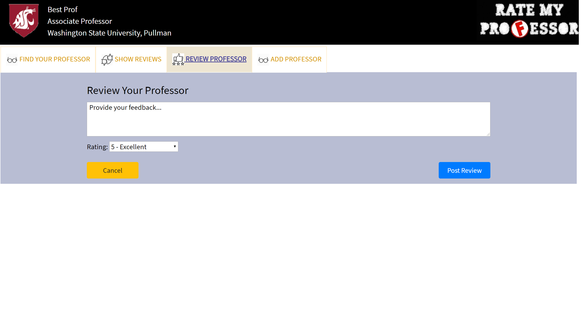

### Task 6: Getting the Form Layout Right

The HTML code for the "ADD PROFESSOR" tab is already provided in the given skeleton code. If you open `index.html` and click at the "ADD PROFESSOR" tab, it should look like this:

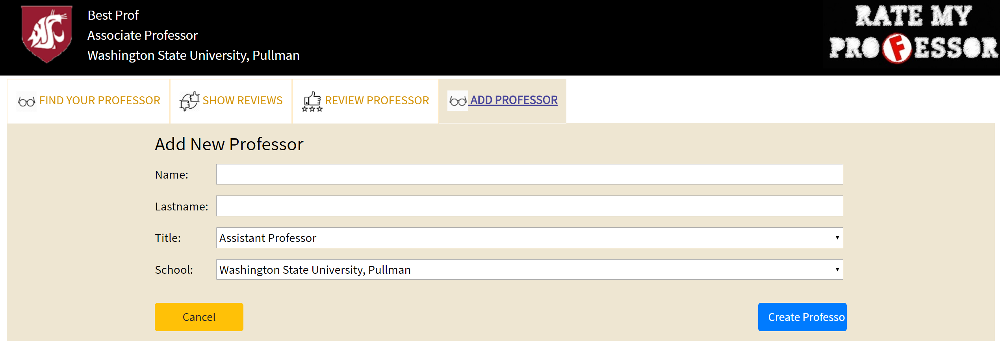

---
### How to Submit
---
#### Submit on GitLab

1.  Commit your changes locally. Make sure you are in branch `part1`. 
    ```
    git checkout part1
    git add .
    git commit -m "Your own commit message"
    ```

1. Push the `part1` branch to GitLab:
    ```
    git push origin part1
    ```
    - You can submit multiple times, after intermediate tasks, but on the deadline
      you need to have submitted the end result.
   

 


