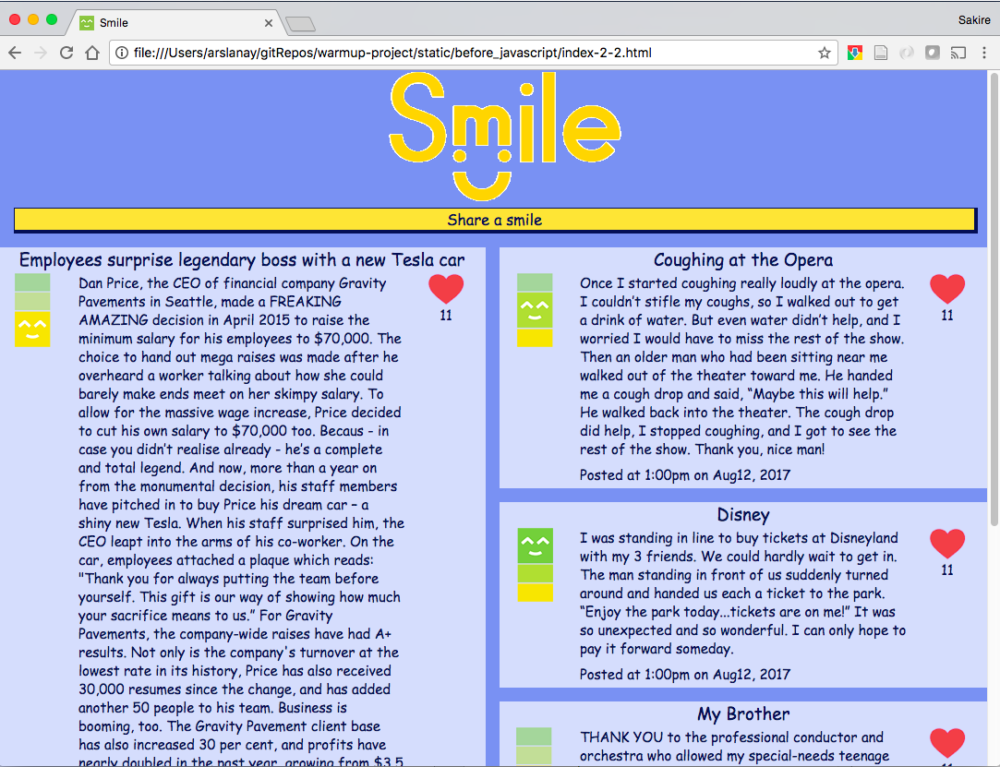
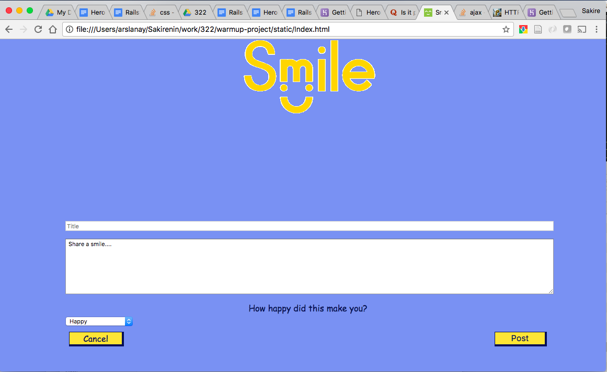

# Smile Project - CptS322 - Fall2018

## Part 2: Javascript - Smiles Become Alive

In part 2, you'll be adding Javascript to make requests to our server to get
smiles and create smiles.
You'll also be adding some Javascript animations to make the UI nicer.

---
### Task 1: Get Started
---
For Part 2 you will need to use and edit the files that you finished for
Part 1. Even if you did not complete all of Part 1, you can still use those
files (you need at least the result of Part 1 Task 2.1; if you did not get the
styling done, your files should still be usable).

1. Create and checkout to part2 branch 

    ```
    git branch part2
    git checkout part2
    ```
   
    Make sure that your 'part2' branch now has the latest part1 code. You will now be editing locally, and **remember to commit frequently**.

2. You will edit the "`static/scripts/smiles.js`" file in addition to "`index.html`", "`create.html`" and "`main.css`" (those you used
   for Part 1):


5. Add code to the `index.html` to load the Javascript files. Add the
following code inside the `<head>` element at the end (not `<header>`).

    ```
    <!-- JQuery library -->
    <script src="https://ajax.googleapis.com/ajax/libs/jquery/3.4.1/jquery.min.js"></script>

    <script type="text/javascript" src="scripts/smiles.js"></script>
    <script type="text/javascript">
        // This is a jQuery convention to say that once all the files
        // load, the function Smile.start() should run.
        // This function is defined in the smiles.js
        $(document).ready(function () {
            Smile().start();
        });
    </script>
    ```

    This code will load the jQuery library and the Javascript library for our
    project (`smiles.js`).

    ---
    Smile Spaces
    ---
    In order to allow all of you to use a common backend, we will keep the
    smile posts separated into "spaces". Each smile post lives in one space, named
    with a non-empty string of length at most 128.

    At the top of `smiles.js` you will see the URL to the backend that you will
    use for Part 2. (In Part 3 of the project you will write your own backend.)
    The provided backend has a space called `initial` that is populated with a few
    smile posts, to help you get started. In the `initial` smile space,
    the shared backend will allow you to
    read the smile posts (Task 2 below), and to increase their like counts (Task 3
    below), but not to add new
    smile posts. When you get to creating new smile posts (Task 4 below),
    you will have to change the `smileSpace` variable in `smiles.js` to
    a new name that will give you your own smile space. ('space' is a attribute in the model(database) in the backend. 
    When you "`get`"" the posts, they will be filtered based on the space.)


### Task 2: Display All Smiles

1. We will not need the posts you have added to `index.html` in Part 1.
   However, we will keep one around to use as a template for
   creating more posts. So, delete all but one of the posts in `index.html`.
   
2. In `scripts/smiles.js`, fill in the function `displaySmiles` to make a GET
   request to our Smile server to get the most recently created 10 smiles.
   - You will need to show the smiles sorted in decreasing order of the
      created time.
  - Our API by default returns smiles sorted with the most recently updated
     smile first.
    You'll need to pass in the right params to our API (see below for
    documentation) to get the proper sorting order. 
  - Please be aware that requests to Heroku backends sometimes take a
     few seconds to return, especially if the backend has not been
     used in a while.
3. In `scripts/smiles.js`, fill in the function `onSuccess` in `displaySmiles`
   to sort the smiles returned from the server, and to call `insertSmile`. 
  - Smiles in the UI should be ordered so that the smile created most
     recently shows at the beginning.
  - In case the server returns an error, you should call the function
    "console.error()" with the error messages from the server.
    
4. Finish the implementation of `insertSmile`
  - You'll need to convert the created timestamp into a user-friendly format
     in the local timezone, using the format "13:08 May 25, 2015". Javascript has a built in
     Date library for converting times.
     Read more about [converting epoch time](http://www.epochconverter.com/programming/#javascript).


    <a name='get_smiles'/>
    #### GET /api/smiles
    
    Gets the most recently updated smiles

    ##### Query Parameters
    ```
    space: the name of the smile space to use. Each smile lives in the separate
            space (mandatory, non-empty, at most 128 characters) 
    count: maximum number of smiles to return (optional, default = all)
    order_by: the name of the field by which to sort in decreasing order. One of:
            like_count
            happiness_level
            updated_at  (default)
            created_at
    ```

    ##### Example Request
    ```
    GET /api/smiles?space=initial&count=5&order_by=created_at
    ```

    ##### Example Response
    The response contains a status field (with value 1 if there were no errors, and -1 if there were errors).
    If there were no errors, then the field `smiles` contains the list of smiles.
    ```javascript
    {
        "status" : 1,
        "smiles": [
                            {
                                "id": 22,
                                "space" : "initial",
                                "title": "Keep smiling",
                                "story": "Initially, I attempted to smile and wave at the people in my neighborhood. But this was met with indifference and often dismissive-ness.\n\nSo, after a while I gave up, kept my head down. I became increasingly dissatisfied with my living conditions and considered moving. But then I realized that I was becoming someone I didn't want to be. So, I started waving and smiling again. Well, this morning while walking my dogs, two neighbors passed me without a glance. I noticed that this didn't feel very nice and I felt discouraged. But a third person passed in their car with a big smile on his face. ​It made my day! I smiled back and kept smiling all the way home. I guess the moral of the story for me was, never underestimate the power of a smile! So keep smiling everyone!",
                                "happiness_level": 3,
                                "like_count": 12,
                                "created_at": "Thu, 06 Sep 2018 16:43:34 GMT",
                                "updated_at": "Thu, 06 Sep 2018 16:47:57 GMT"
                            },
                            ...
        ]
    }
    ```

    If there were errors, then the response contains only one field:
    ```javascript
    {
        "status" : -1
    }
    ```

    At this point if you open `index.html` it should look like this:

    
    [Part 2 Task 2]

---
### Task 3: Handle Liking a Smile
---
Now we'll handle incrementing the like count for the clicked on smile.

1. In the `attachLikeHandler` function add code to find the `smileId` of the
    clicked Like button.
    - You can use the JavaScript debugger in your browser to put a breakpoint
       on the `smileId` and the click a Like button.
    - Recall that in the code that you modified in Task 2, the `id` of
       each smile is set as an attribute for the smile `<article>`.
    - In jQuery, the event handler received the DOM element on which
       the event was triggered in the `this` variable.
    - In jQuery, there is a function called `parents` that allows you
       find parents of an element given some selector. 

1. In the `attachLikeHandler` function add code to make a POST request to
   increase the like count.
     - See documentation below for the POST request
     - Upon success this POST request returns the updated JSON data
        for the smile that was liked.

1. In the `onSuccess` handler in the `attachLikeHandler` function,
    add code to update the like count of the updated smile,
    based on the data returned by the POST request.
    - In case the server returns an error, you should call the function
      "console.error()" with the error messages from the server.


    <a name='post_like'>
    #### POST /api/smiles/:id/like
    
    Like specified smile. Liking a smile updates its `updated_at` timestamp.

    ##### Example Request
    ```
    POST /api/smiles/18/like
    ```

    ##### Example Response
    The response contains a status field (with value 1 if there were no errors, and -1 if there were errors).
    If there were no errors, then the field `smile` contains the updated smile.
    ```javascript
        {
            "status": 1
            "smile": {
                "id": 18,
                "title": "People Chain",
                "story": "While hiking in Muir woods a car suddenly drove off the road into a river. Immediately three separate groups of strangers stopped and began sprinting to the scene. The first three to arrive were from different groups and immediately made a human chain to allow the first person to repel down the hill. The group pulled all four people from the black sedan. After the ordeal, there was a moment when all the strangers made eye contact and realized how special it was that without saying a word everyone raced to the scene and worked together.",
                "happiness_level": 1,
                "like_count": 2,
                "space": "initial",
                "created_at": "Thu, 06 Sep 2018 16:42:30 GMT",
                "updated_at": "Thu, 06 Sep 2018 16:42:30 GMT"
            }
        }
    ```

    If there were errors, then the response contains only one field:
    ```javascript
    {
        "status" : -1
    }
    ```

---
### Task 4: Handle Creating a New Smile
---
Let's move the create form onto the home page, so we don't load a new webpage
every time a user decides to post a smile.
Now that we know some Javascript, we can use it to hide most of the form by
default and
just show it when users intend to share a smile.

1. Go to the "`create.html`" that you created in Part 1, and copy the HTML for
   the "`<form>`" to "`index.html`" inside the "`<div class="create">`", after the
   'Share a smile...' link.

1. The function "`attachCreateHandler`" hides the "`<form>` when it starts
   (already implemented). This means that the "`<form>`" is there but
   we do not see it initially. 

1. Change the function "`attachCreateHandler`" to add a handler for the `Share a smile...` link, to show the "`<form>`"" and hide the `Share a smile...` link and the 'smiles' content.
(Hint: In the beginning of `smiles.js` we create the containers 'smiles' and 'create', refering to "`smiles`" content and the "`create`"" content respectively. In JQuery you may use "`hide()"` and "`show()"` functions to hide and show content. For example: "`smiles.find('.share-smile').hide()`"" will hide the `Share a smile...` button (class "`share-smile`). `smiles.hide()`" will hide the complete "`smiles`" content.) 

    At this point, if you open `index.html` and click on the `Share a smile...` you will see the following:

    
    [Part 2 Task 4]

1. Edit the value of the "`smileSpace`" in "`smiles.js`" to pick a new smile
   space where you can create smiles. It is probably easier to pick a
   name that nobody is likely to use, but you can also share a space
   with friends, as long as you understand that you will all be
   creating smiles there. 
   
1. Change the function "`attachCreateHandler`" to add a handler
   for the Cancel button in the form, to close the form  (without reloading the page).

1. Change the function `attachCreateHandler`,
    to finish the implementation of
    the existing handler for the submit button for the form:
      - Add code to collect the remaining fields of the new smile
      - Add code at the end of the handler to make the POST
         request (see documentation below), and to close the form.
       - Add code to the "`onSuccess`" handler to insert
          the newly added smile at the beginning of the
          current list of smiles. 
      - In case the server returns an error, you should call the function
        "console.error()" with the error messages from the server.

    <a name='post_create'>
    #### POST /api/smiles
    
    Create a new smile.

    ##### Example Request
    ```
    POST /api/smiles
    ```
    with the following data:
    ```javascript
    {
        "title": "Pursue fulfilling goals",
        "space": "my space",
        "story": "The goals that give you the most happiness and fulfillment are  those that are authentic and intrinsic - meaning it's a cause you personally really believe in. It's not done out of pressure from peers, parents, or family. It's not done just to gain ego, money, or power. You do it because you believe it's right, that it'll help yourself and others.",
        "happiness_level": 3,
        "like_count": 0
    }
    ```

    ##### Example Response
    The response contains a status field (with value 1 if there were no errors, and -1 if there were errors).
    If there were no errors, then the field `smile` contains the created smile.
    ```javascript
    {
        "smile": {
            "created_at": "Wed, 21 Aug 2019 15:44:38 GMT",
            "happiness_level": 3,
            "id": 23,
            "like_count": 0,
            "space": "my space",
            "story": "The goals that give you the most happiness and fulfillment are  those that are authentic and intrinsic - meaning it's a cause you personally really believe in. It's not done out of pressure from peers, parents, or family. It's not done just to gain ego, money, or power. You do it because you believe it's right, that it'll help yourself and others.",
            "title": "Pursue fulfilling goals",
            "updated_at": "Wed, 21 Aug 2019 15:44:38 GMT"
        },
        "status": 1
    }
    ```

    If there were errors, then the response contains only one field:
    ```javascript
    {
        "status" : -1    }

    ```

---
### Task 5: Add Error Checking for Creating a New Smile
---
1. In case the user tries to create an invalid smile,
    we want the JavaScript to tell the user, without
    submitting the data to the server.
    - Show an error if the "`title`" is empty or longer than 64 characters.
    - Show an error if the "`happiness-level`" is not between 1 and 3
    - Show an error if the "`story`" is empty, or longer than 2048 characters.
    - Use a Javascript "alert(...)" statement to report the error. The text of
      the alert should contain all errors in the data, one per line. 

---
### How to Submit
---
#### Submit on GitLab. 

1.  Commit your changes locally. Make sure you are in branch `part2`.
    ```
    git add .
    git commit -m "Your own commit message"
    ```

1. Push the `part2` branch to GitHub:
    ```
    git push origin part2
    ```
    - You can submit multiple times, after intermediate tasks, but on the deadline
      you need to have submitted the end result.
   